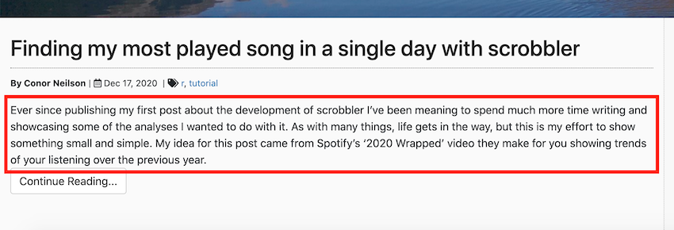
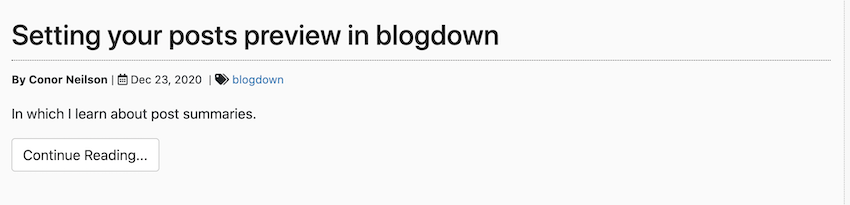

In which I learn about post summaries.

<!--more-->

In various hugo themes, you get the option of having a 'preview' of the text that your post contains. For example, this is how it looks on my blog:

I've always been irritated by not being able to control what text went into that little description section. Early in my blogdown journey I looked into it, but quickly got lost in Hugo's `.Summary` and `.Summary.Description` parameters which scared me off. 

However, I recently decided to have another go, and when perusing Hugo's [documentation](https://gohugo.io/content-management/summaries/) I came across the html `<!--more-->` snippet. Turns out, if you add that piece of html, then everything above will be included in the post summary, and anything below will not. This seemed a straightforward, easy solution to the problem I was facing. The only difficult bit was that it is a fairly non-trivial piece of html to remember, so I just went and added it to my blogs standard post [archetype](https://github.com/condwanaland/Still-the-Data/blob/master/themes/silhouette-hugo/archetypes/post.md). Now everytime I create a new post, that little bit is inserted and I remember to write a summary. You can see how it looks for this exact post.

Going forward I'll write all my posts with this in mind. My only outstanding question is whether it is possible to include the summary in the post overview, but dont actually show it when you open the post (as it can read a bit weirdly sometimes). Back to the research...

And Merry Christmas!