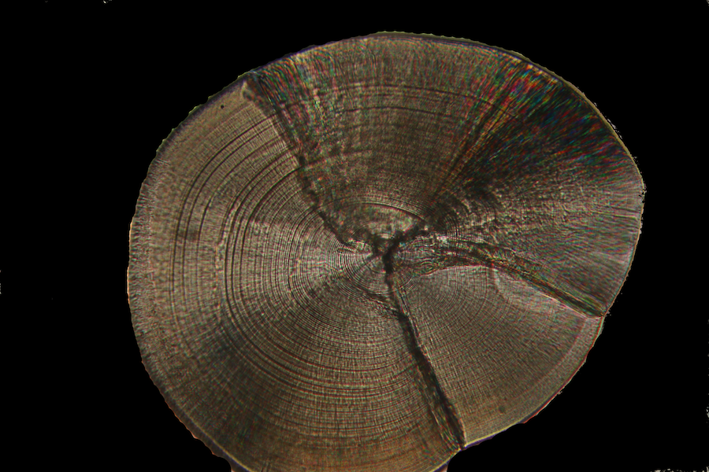
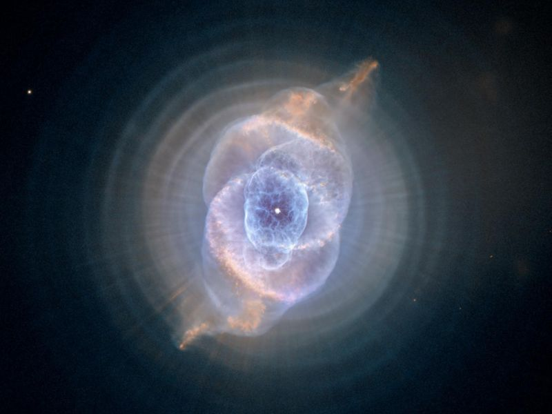

Recently I made a logo for my in-development `nebula` package. This is how it's done.

<!--more-->

Before I get into this post, I need to point out that all the work in this stands on the shoulders of the incredible developer, [Thomas Lin Pedersen](https://www.data-imaginist.com/). The work here heavily relies on his [ambient](https://github.com/thomasp85/ambient) and [ggfx](https://github.com/thomasp85/ggfx) packages, so most credit is due to him.


My [`nebula`](https://github.com/condwanaland/nebula) package is designed to help interactively age fish through counting the growth rings present in their 'otoliths' (ear bones). As an example, see the image below of an otolith I collected from a New Zealand [*Galaxias maculatus*](https://en.wikipedia.org/wiki/Common_galaxias).

{width=400px height=300px}

This otolith is approx 0.5mm across, and each ring one day of growth in the fish (so this fish is approx 120 days old).

The reason `nebula` is named so, is that the rings of an otolith remind me of the rings sometimes seen in nebulas.

{width=400px height=300px}

With these thoughts in mind, I wanted a logo representing the void-y, almost cloud like nature of nebulas, along with the rings from an otolith. To do this, I started with `ambient`.

Following Thomas' examples, I started by generating a grid of values, and then adding some perlin noise to it (note that I am not showing the seed I used to generate this, so my logo will always be slightly unique).

```{r setup, echo=FALSE}
knitr::opts_chunk$set(echo = TRUE, fig.path = "static")
```


```{r message=FALSE}
library(ggforce)
library(ggfx)
library(ambient)
library(dplyr)
library(viridisLite)

grid <- long_grid(x = seq(0, 1, length.out = 100),
                  y = seq(0, 1, length.out = 100))

grid <- grid %>% 
  mutate(
    noise = fracture(gen_perlin, fbm, octaves = 4, x = x, y = y, freq_init = 5)
  )

grid
```

This doesn't look like much, but now we can plot something.

```{r}
ggplot() +
  geom_raster(aes(
    x = x,
    y = y,
    fill = noise),
  data = grid)
```

Lets make this a bit more bold by giving it a different color scheme.

```{r}
ggplot() +
  geom_raster(aes(
    x = x,
    y = y,
    fill = noise),
  data = grid) + 
  scale_fill_viridis_c(option = "inferno")
```

Lets continue by adding some circles to this to represent the otolith rings (`geom_circle` requires the coordinate system to be fixed, so we do that here). We'll also remove things like legend, axes, and grid lines. 

```{r}
ggplot() +
  geom_raster(aes(
      x = x,
      y = y,
      fill = noise),
    data = grid) + 
  geom_circle(aes(x0 = 0.5, y0 = 0.5, r = seq(0.1, 0.5, by = 0.1)),
                fill = NA,
                size = 3) +
  coord_fixed() +
  scale_fill_viridis_c(option = "inferno") +
  theme_void() +
  theme(legend.position = "none")
```

We'll now use our first function from `ggfx`, `with_blur` to blur these rings a bit. This makes them much less harsh, and looks more like what you'd get from an otolith. Here the parameter 'sigma' controls the amount of blur we want. 

```{r}
ggplot() +
  geom_raster(aes(
      x = x,
      y = y,
      fill = noise),
    data = grid) + 
  with_blur(
      geom_circle(aes(x0 = 0.5, y0 = 0.5, r = seq(0.1, 0.5, by = 0.1)),
                fill = NA,
                size = 3),
    sigma = 4) +
  coord_fixed() +
  scale_fill_viridis_c(option = "inferno") +
  theme_void() +
  theme(legend.position = "none")
```

Now we'll add a layer of text in for the packages name. We'll start by just adding it as a simple layer, then blending it in later.

```{r}
ggplot() +
  geom_raster(aes(
      x = x,
      y = y,
      fill = noise),
    data = grid) + 
  geom_text(aes(x = 0.5, y = 0.5, label = 'Nebula'), size = 19) +
  with_blur(
      geom_circle(aes(x0 = 0.5, y0 = 0.5, r = seq(0.1, 0.5, by = 0.1)),
                fill = NA,
                size = 3),
    sigma = 4) +
  coord_fixed() +
  scale_fill_viridis_c(option = "inferno") +
  theme_void() +
  theme(legend.position = "none")
```

Then finally, we want to blend the circle layer and the text layer together. Check out [Thomas' release post](https://www.data-imaginist.com/2021/say-goodbye-to-good-taste/) for an explanation of how this works. 

```{r}
ggplot() +
  geom_raster(mapping = aes(x = x, y = y, fill = noise), data = grid) + 
  as_reference(
    geom_text(aes(x = 0.5, y = 0.5, label = 'Nebula'), size = 19, family = 'Fontania'),
    id = 'text_layer'
  ) +
  with_blend(
    with_blur(
      geom_circle(aes(x0 = 0.5, y0 = 0.5, r = seq(0.1, 0.5, by = 0.1)),
                fill = NA,
                size = 3),
    sigma = 4),
    bg_layer = 'text_layer',
    blend_type = 'xor'
  ) + 
  scale_fill_viridis_c(option = "inferno") +
  coord_fixed() +
  theme_void() +
  theme(legend.position = "none")
```

And that is the `nebula` logo, made entirely within R. To turn it into the classic 'hex' shape used by most R logos, I ran it through [loonapix](https://www.loonapix.com/trimmer/).

I should clarify here that I am not a designer, and I do not claim that this is an objectively 'good' piece of design. However, I am happy with it, and I really enjoyed creating it. I hope you also have fun exploring these packages. 
