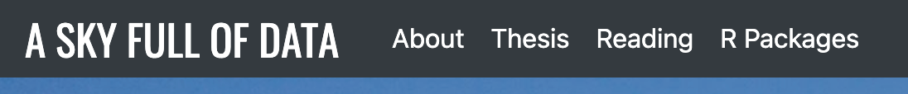
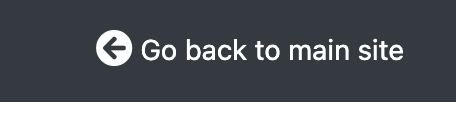

Make your `pkgdown` websites be part of your `blogdown` website. 

<!--more-->

## Context

I have websites set up using both `blogdown` and `pkgdown`. The reason for using both is they solve very different problems. For instance I have
1. My main personal website, built with blogdown, and hosted by Netlify
1. Individual websites for R packages, built with pkgdown, and hosted on Github Pages

This is a case where it's appropriate to be using both. I want a general purpose website, and this is what `blogdown` is good for. I could of course just manually create pages in `blogdown` for each of my R packages, but `pkgdown` does such a good job of turning your existing documentation into a website that its hard to justify not using it.

Using both of these solutions ends up creating a large dichotomy in my work. Not only are different domains used (conorneilson.com vs condwanaland.github.io) but the styles of the websites are totally different. In short, I wanted to bring these closer together. I still wanted to take advantage of `pkgdowns` ability to build the html, but I wanted the style to be closer to my main site, and I wanted it to be served under the same domain as my main website. Therefore this problem can be broken down into two pieces:

1. Making package websites be part of the `blogdown` website
2. Getting the styles of my `blogdown` theme and `pkgdown` to match

We'll tackle these two individually. 

**Note:**, *I use netlify to both build and deploy my blogdown site - some pieces below are specific to that. If you use another hosting service there may be some differences.*


## One domain, indivisible

The first part is the easier of the two. We still want to generate the package websites with `pkgdown`, but we want them to be bundled with the `blogdown` site, and therefore served with it. To do this, we're going to exploit `blogdown`s ability to serve arbitrary files by using the static directory. 

### Arbitrary files with static

Hugo websites have a 'static' directory where you can store arbitrary files. `pkgdown` websites are one example of this, but we really could store anything here (i.e., a `bookdown` book). Hugo knows not to do any processing on this directory which is what allows us to store an already built website. 

Navigate to your blogdown website directory and go into the `/static/` folder. Then create the folders `/r/your_pkg_name/`. The `your_pkg_name` folder is where we'll put your files. For me, my new folder was `/static/r/fishdata/`. We leave the folder empty for now, and will come back to it later.

#### A digression - index page for your packages

I wanted to have an index page where I listed my packages, and each name would link to the respective page. This would mean you could navigate to a specific part of the website (https://conorneilson.com/r/) and see a landing page displaying all the packages I have. As an example, you can see mine [here](https://conorneilson.com/r/). 

To make this, go to the `content` directory, and then create a folder called `r`. Inside that folder, make a file called `index.md`. Here you can use markdown to write the contents of your index page. My first version looked like this

```
---
title: R Packages
---

I've written several R packages, mostly for my own learning and enjoyment. I started writing packages when I finished my MSc, and kinda just kept on doing it here and there. This is a list of everything I consider it be either in a useable state, or is being actively developed on. 

-   [fishdata](/r/fishdata/): A Small Collection of Fish Population Datasets
```

Notice how I'm able to link to the correct place by just doing (/r/fishdata) - we are exploiting how hugo copies things over to make the linking easy like this. 

Most blogdown sites have some links to pages in their navbar/sidebar like 'About Me', 'CV', etc. I like to use this `/r/index.md` file to create one of these top level links so people can easily find the page of R packages. When its done, my page navbar looks like this:




Unfortunately, the way to do this can differ a lot between themes so you'll have to do some searching.

Now that we have directories for the files to go lets look at how to copy them over.


### Putting the pkgdown files in blogdown

I'm assuming you're using RStudio Projects for this, but if not it should still work. Open up the R package that you're working with and bring up its `_pkgdown.yml` file (obviously if this package does not have a pkgdown website yet you'll need to go through the pkgdown setup process). 

A normal `pkgdown` workflow involves using `build_site()` to generate a `/docs/` directory which stores the html files. However, one powerful feature of this workflow is the destination doesn't have to be a `/docs/` directory - you can specify the output to land in another location. In your `_pkgdown.yml` file, add a field called 'destination' (you may already have one) and put the path to the `/static/r/your_pkg_name/` folder we created earlier. Note, this has to be relative to where the `_pkgdown.yml` file is located, so you may have to go up one or two directories. This is what mine looks like, but please be aware that this will be different depending on how your computers folders are set up. 

```
destination: '../a-sky-full-of-data/static/r/scrobbler
```

Notice I go up one directory, then into my blog (`a-sky-full-of-data`), then `static/r/pkg_name`. 

Now anytime you're working on your package and you're ready to release a new version, just call `build_site()` and the files will go straight into your blogdown directory. Note that this method scales to any number of packages - just add another folder for them under `/static/r/`, modify the 'destination' field so it goes to the right folder, and edit your `index.md` file to add another link. 

Now go back to blogdown (I keep two RStudio sessions open, one for each Project, to make it easy to switch back and forth). If you check the 'git' pane in RStudio (or run `git status`) you should see a whole bunch of new files there. Add and commit them all, and push them to github. If you've set up Netlify to build from your github directory, then all you have to do is wait for your site to redeploy (which should be quick). Check out what you've done by navigating to `yourwebsite/r`. You should see the index page you created, which has a link to your package. Click on that, and you should see the pkgdown pages, being served under `yourwebsite/r/pkgname`. They still probably look totally different, but we'll get to that soon. 

Lets just summarise what we've done so far, as this approach is what you need to add any number of pkgdown sites to your blogdown site.

1. Create a `/static/r/pkgname/` directory in your blogdown site
1. Create (or edit an existing) `/content/r/index.md` file to have a link to `/r/pkgname`
1. Modify the 'destination' field in your packages `_pkgdown.yml` site to point to your above directory
1. Run `build_site()` in your package directory
1. In your blogdown directory, commit and push the files


Finally, lets get on to changing the look of the pkgdown website


## Peas in a pod

This is potentially the tricky part, as we'll need to start playing around with CSS. Please note, I know very very little CSS, and what I did here was basically me stumbling in the dark - there may be better ways. 

The difficulty of this bit will also really depend on the complexity of your blogdown site. Mine is pretty straightforward and looks pretty similar to a pkgdown site already. They both have a navbar at the top so my main goals were to make the navbars have the same style and color, and for both navbar and body fonts to be the same. 

Finding the right CSS to modify can be difficult and is out of scope for this post. If you need assistance here I recommend checking out this [intro to CSS in a browser](https://support.helpdocs.io/article/eh3pzxNwYf-grabbing-css-selectors-from-your-browser).


### Modifying pkgdown CSS

The main thing to first solve was to find the colour that my blogdown site used for its navbar. After looking through the CSS I found it was using '#343a40' (dark, almost black). Another feature of my site was that it didn't include any hover or focusing elements, so I needed to remove those.

The CSS I needed was the following

```
body {
    font-family: -apple-system,BlinkMacSystemFont,"Segoe UI",Roboto,"Helvetica Neue",Arial,sans-serif,"Apple Color Emoji","Segoe UI Emoji","Segoe UI Symbol","Noto Color Emoji";
    font-size: 14px;
    line-height: 1.42857143;
    color: #212529;
    background-color: #fff;
}


.navbar-default {
    background-color: #343a40;
    border-color: #343a40;
}
/* Title */
.navbar-default .navbar-brand {
    color: #ffffff;
}

.navbar-default .navbar-nav > li > a {
    color: #ffffff;
}

.navbar-default .navbar-nav > li > a:hover,
.navbar-default .navbar-nav > li > a:focus {
    color: #ffffff;
}


.navbar-default .navbar-nav > .active > a,
.navbar-default .navbar-nav > .active > a:hover,
.navbar-default .navbar-nav > .active > a:focus {
    color: #ffffff;
    background-color: #343a40;
}


.navbar-default .navbar-link,
.navbar-default .navbar-link:hover {
    color: #ffffff;
}
```

To include this CSS in your pkgdown site, you need to create a `/pkgdown/extra.css` file at the root of your site. Any CSS defined in here will be added into the pkgdown site. 


## Linking back

One thing you'll want to add to your pkgdown site is a link back your main site. You can do this in your `_pkgdown.yml` file. I added the following 

```
navbar:
  right:
  - icon: fa-arrow-circle-left fa-lg
    href: https://conorneilson.com/r
    text: Go back to main site
```

So now the navbar will have this link applied to the right hand side of it. On my site it looks like this:



## Testing

With this all done, you can now start testing this out. `pkgdown` has a `preview_site` function that allows you to preview the look of your site, however I found that this function wasn't applying my custom CSS, so in order to see how it looked I would run `build_site` and then check the preview that it opens automatically upon completion.

After running `build_site` have a look at the website. Does it look like your main site? Are there any large inconsistencies? Go through a period of iteration here where you make tweaks and preview the site in between changes. It is up to you how detail oriented you become here - personally I was happy with something that looked approximately correct. 

Once you're happy with the look of your site, you're ready to deploy it. Run `build_site` one more time (remember that we've set `destination` to copy the output files into your blogdown directory), and then go through the process of deploying your blogdown site (for me, this is just a push to github and then Netlify handles building and deploying it). 


## Another pkgdown site?

If you have more than one pkgdown site you want to integrate, just follow the same process but with two changes. 

1. Firstly, you don't want to create a new `index.md` file under `/r/content`. Instead, just edit your existing one to add another link (to your 2nd site).
1. Secondly, you already know all the CSS you need. However, you don't need to copy it all again. Instead when you create a new `/pkgdown/extra.css` you just need to add this line to it

```
@import url("path/to/your/first/extra.css/file");
```

That first CSS file you created is located in your sites directory, so you can just point it to that. For instance, mine looks like this
```
@import url("https://conorneilson.com/r/fishdata/extra.css");
```

Note that I didn't do anything special to make the CSS file be located there - that's just where we placed it earlier automatically. Therefore Iif you've been followng this tutorial your link should be very similar. 


## Wrapping up

As you can see, it can be a bit involved integrating these two systems. However if you work through it you are rewarded with having a more impressive blogdown site, and no longer having to worry about two different hosting solutions. 

This was a bit of a long post, so if anything is unclear, please feel free to reach out - I'm happy to explain anything that doesn't make sense. And don't forget, you can always check out the source code of my website [here](https://github.com/condwanaland/A-Sky-Full-of-Data). Everything we've been over lies in the `content` or `static` directory, so hopefully that can also help you.

Best of luck...